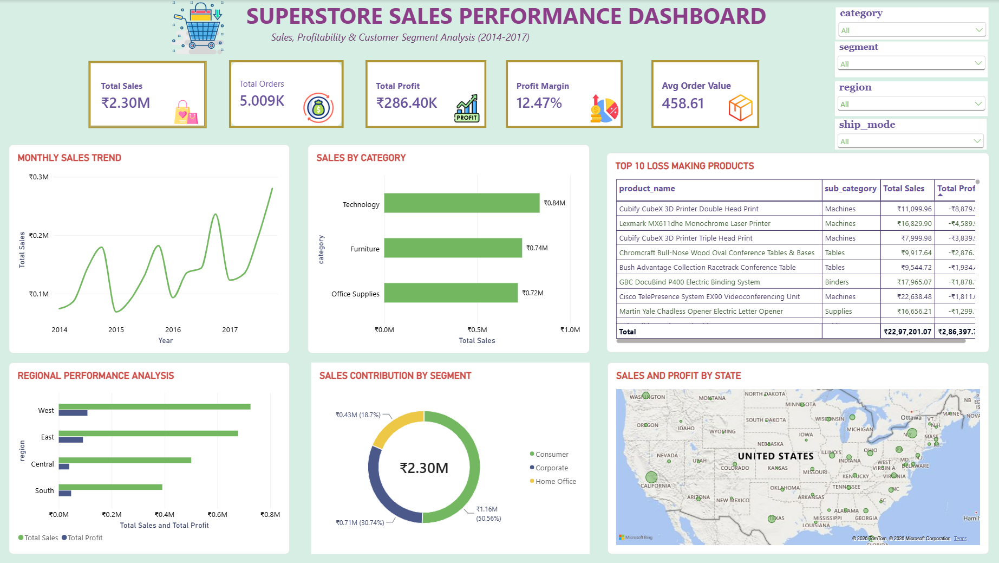

# 🛒 Retail Performance and Profitability Analytics

An end-to-end data analytics project that explores Superstore sales data using **SQL** and **Power BI** to uncover insights on sales, profit, customers, and products.

---

## 📌 Project Overview

Superstore is a retail business selling Furniture, Office Supplies, and Technology products across multiple regions. The goal of this project is to analyze historical sales data to understand business performance and support data-driven decisions.

**Key business questions answered:**
- How are sales and profit trending over time?
- Which categories, sub-categories, and products perform best (and worst)?
- Which regions, states, and cities drive the most revenue?
- Who are the most valuable customers and segments?
- What impact do discounts have on profit?
- How do shipping modes affect sales and delivery?

---

## 🛠️ Tools & Technologies

| Tool | Purpose |
|------|---------|
| **Excel** | Raw dataset and initial inspection |
| **SQL** | Data cleaning, exploration, and business queries |
| **Power BI** | Interactive dashboard and visualization |
| **GitHub** | Version control and project documentation |

---

## 📁 Repository Structure

```
Superstore_Sales_Analysis/
│
├── DashboardImages/
│   ├── Customer and Product insight.png
│   ├── Salesstore_Overview.png
│   └── README.md
│
├── Dataset/
│   ├── Superstore_Sales.xlsx
│   └── README.md
│
├── Powerbi/
│   ├── Superstore_Sales_dashboard.pbix
│   └── README.md
│
├── Sql/
│   ├── Superstore.sql
│   └── README.md
│
└── README.md
```

---

## 📊 Dataset

- **File:** `Dataset/Superstore_Sales.xlsx`
- **Contents:** Order details, customer information, product details, sales, quantity, discount, profit, shipping mode, and regional data.
- **Key fields:** Order ID, Order Date, Ship Date, Ship Mode, Customer ID, Segment, Region, State, City, Category, Sub-Category, Product Name, Sales, Quantity, Discount, Profit.

---

## 🧮 SQL Analysis

The `Sql/Superstore.sql` file contains queries covering:

- Data cleaning and validation (nulls, duplicates, data types)
- Total sales, profit, and quantity KPIs
- Year-over-year and month-over-month trends
- Top and bottom products / sub-categories
- Regional and state-level performance
- Customer segmentation and top customers
- Discount vs. profit analysis
- Shipping mode analysis

---

## 📈 Power BI Dashboard

The dashboard (`Powerbi/Superstore_Sales_dashboard.pbix`) includes two main views:

### 1. Sales Overview
- KPI cards: Total Sales, Total Profit, Quantity, Profit Margin
- Sales and profit trends over time
- Performance by category and region

### 2. Customer & Product Insights
- Top customers and segment breakdown
- Best and worst performing products
- Sub-category profitability




---

## 🔍 Key Insights


- Technology generates the highest profit, while some Furniture sub-categories (e.g., Tables) run at a loss.
  

---

## 🚀 How to Run This Project

1. **Clone the repository**
   ```bash
   git clone https://github.com/AnkitaBhali/Superstore_Sales_Analysis.git
   ```
2. **Explore the data** – open `Dataset/Superstore_Sales.xlsx`.
3. **Run SQL queries** – import the data into your SQL database and run `Sql/Superstore.sql`.
4. **View the dashboard** – open `Powerbi/Superstore_Sales_dashboard.pbix` in Power BI Desktop.

---

## ✅ Recommendations

- Reduce deep discounts on low-margin products.
- Focus marketing on high-profit categories and regions.
- Review or phase out consistently loss-making products.
- Build loyalty programs for top-value customers.

---

## 👩‍💻 Author

**Ankita Bhali**
GitHub: [@AnkitaBhali](https://github.com/AnkitaBhali)

---

⭐ If you found this project useful, consider giving it a star!
